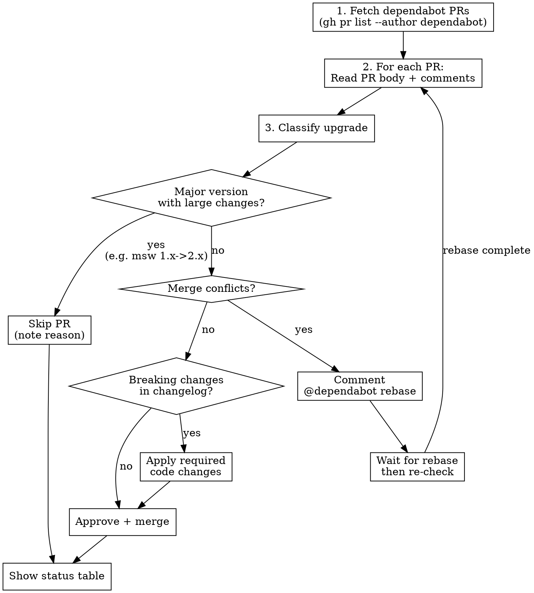

# Dependabot PR Review

Review and process dependabot PRs: approve safe upgrades, apply breaking changes, skip infeasible major bumps, and rebase conflicted PRs.

## Trigger

- "review dependabot PRs" / "review all dependabot PRs"
- "review dependabot PR #123"
- Any request specifically mentioning dependabot PR review

## Workflow



## Step-by-step

### 1. Fetch PRs

If no specific PRs given, list all open dependabot PRs:

```bash
gh pr list --author "app/dependabot" --state open --json number,title,url,mergeable,labels
```

If specific PR numbers given, fetch those directly.

### 2. Read each PR

For each PR, read the full body and comments:

```bash
gh pr view <number> --json body,title,number,url,mergeable,headRefName,comments
```

**Extract from the PR body:**
- Current version -> new version
- Release notes / changelog section
- Breaking changes
- Compatibility notes

### 3. Classify the upgrade

| Type | Action |
|------|--------|
| Patch bump (1.2.3 -> 1.2.4) | Auto-approve unless breaking |
| Minor bump (1.2.0 -> 1.3.0) | Review changelog, approve if safe |
| Major bump, small scope (2.0.0 -> 3.0.0, few breaking changes) | Apply required changes, approve |
| Major bump, large scope (1.x -> 2.x, extensive API changes like `msw`) | **Skip** - note in table |

**Skip criteria for major bumps:**
- Extensive API surface changes requiring many code modifications
- Migration guides longer than a few steps
- Dependencies used pervasively throughout the codebase

### 4. Check for merge conflicts

```bash
# Check mergeable status from PR data
# If conflicts exist:
gh pr comment <number> --body "@dependabot rebase"
```

Track rebasing PRs. After processing all others, re-check rebased PRs.

### 5. Handle breaking changes

**CRITICAL: Read the changelog/release notes carefully.**

When breaking changes exist, maintain existing behavior by applying the minimum required changes. Example pattern:

A library enables a new feature by default in a major version. To maintain existing behavior:

```diff
- uses: library/action@v1
+ uses: library/action@v3
  with:
    existing_option: value
+   new_default_feature: false   # preserve pre-v3 behavior
```

**Process:**
1. Read breaking changes from PR body
2. Search codebase for affected usage: `grep -r` for the dependency
3. Determine minimal changes to preserve current behavior
4. Apply changes on the PR branch:

```bash
gh pr checkout <number>
# make changes
git add -A && git commit -m "apply breaking change migration"
git push
```

### 6. Approve and merge

```bash
gh pr review <number> --approve --body "Reviewed changelog. Safe upgrade."
gh pr merge <number> --squash
```

### 7. Re-check rebased PRs

For PRs where `@dependabot rebase` was commented:

```bash
# Check if rebase is complete (PR updated, no conflicts)
gh pr view <number> --json mergeable,updatedAt
```

If rebase complete, resume from step 2 for that PR.

### 8. Show status table

After processing all PRs, display a summary table:

```
| PR | Package | Version Change | Status | Notes |
|----|---------|---------------|--------|-------|
| #42 | lodash | 4.17.20 -> 4.17.21 | Merged | Patch bump |
| #43 | webpack | 5.88.0 -> 5.91.0 | Merged | Minor, no breaking |
| #44 | sentry/action | v1 -> v3 | Merged | Applied inject:false |
| #45 | msw | 1.3.2 -> 2.7.3 | Skipped | Major rewrite needed |
| #46 | react-query | 4.0 -> 5.0 | Rebasing | @dependabot rebase sent |
```

## Common Mistakes

| Mistake | Fix |
|---------|-----|
| Merging major bumps without reading changelog | ALWAYS read release notes/changelog/breaking changes |
| Not applying config to preserve existing behavior | When defaults change, explicitly set the old default |
| Approving PRs with merge conflicts | Check mergeable status first, rebase if needed |
| Forgetting to re-check rebased PRs | Track them and loop back |
| Skipping all major bumps | Small-scope major bumps with clear migration are fine |
